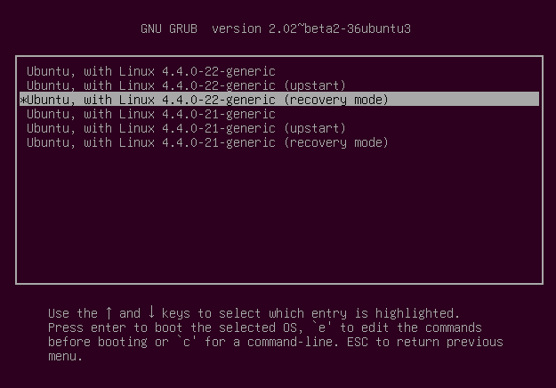
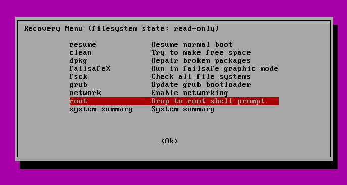

# Ubuntu 16.04/18.04 重置登录密码

## 1 进入Recovery Mode

Recovery Mode即恢复模式；在Grub启动菜单选择“Advanced Options for Ubuntu”

## 2 选择 root Drop to root shell prompt

进入恢复菜单选择 root。。。

然后回车；

## 3 依次执行如下命令

# mount -o rw,remount /
# ls /home      # 系统中的用户

# passwd NEW_PASSWORD #重置密码

## 4 执行exit命令回到导航菜单，选择resume。。。正常启动系统。
